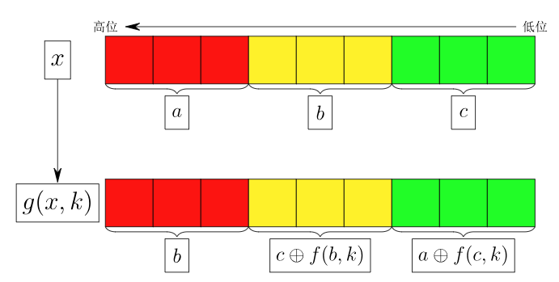

# 数字变换 (transform)

## 题目描述

小C 设计了一种变换 $F$，若输入 $[0, 2^9)$ 中的整数，则输出也是 $[0, 2^9)$ 中的整数。
记 $\oplus$ 为按位异或运算，即 C++/Java/Python 中的 `^` 运算符。

若 $x, k$ 均为 $[0, 2^3)$ 内的整数，定义 $f(x, k) = ((x^2 + k^2) \bmod 2^3) \oplus k$。

若 $x$ 为 $[0, 2^9)$ 内的整数，$k$ 为 $[0, 2^3)$ 内的整数。将 $x$ 的二进制表示进行高位补零的操作，使其恰好为 9 位。$g(x, k)$ 将会把这 9 个二进制位分为高三位、中三位、低三位三组并将其视为三个数字分别进行变换，具体如下：

假设 $x$ 的 9 位二进制表示分为三部分 $a, b, c$，其中 $a$ 为高三位，$b$ 为中三位，$c$ 为低三位（即 $x = a \cdot 2^6 + b \cdot 2^3 + c$）。

变换 $g(x, k)$ 得到的新的三部分 $a', b', c'$ 计算如下：
- High ($a'$): $b$
- Mid ($b'$): $c \oplus f(b, k)$
- Low ($c'$): $a \oplus f(c, k)$

即 $g(x, k)$ 的结果为 $b \cdot 2^6 + (c \oplus f(b, k)) \cdot 2^3 + (a \oplus f(c, k))$。



记 $f_0$ 为 $F$ 变换的输入值，并定义 $f_i = g(f_{i-1}, k_i)$, $i \in \{1, 2, 3, \cdots, m\}$, 则 $f_m$ 为 $F$ 变换的输出值。长为 $m$ 的序列 $k$ 是一个给定的参数序列，并且其中每个数字都是 $[0, 2^3)$ 之间的整数。

现在小C 有 $n$ 个经过 $F$ 变换后得到的值，分别为 $a_1, a_2, \cdots, a_n$，小 C 想知道它们对应的输入分别是什么。

## 输入格式

从标准输入读入数据。
第一行两个正整数 $n, m$。
第二行有 $m$ 个非负整数，分别为 $k_1, k_2, \cdots, k_m$。
第三行有 $n$ 个非负整数，分别为 $a_1, a_2, \cdots, a_n$。

## 输出格式

输出到标准输出。
输出一行 $n$ 个非负整数，表示 $a_1, a_2, \cdots, a_n$ 对应的输入。

## 样例 1 输入
```
1 2
3 5
504
```

## 样例 1 输出
```
101
```

## 样例 1 解释
可以枚举可能的输入并验证。

若枚举到的输入为 $f_0 = 101$。

对于 $f_1 = g(101, 3)$ 来说: $a=1, b=4, c=5$, $c \oplus f(b, 3) = 7$, $a \oplus f(c, 3) = 0$, 故 $f_1 = 312$。

对于 $f_2 = g(312, 5)$ 来说: $a=4, b=7, c=0$, $c \oplus f(b, 5) = 7$, $a \oplus f(c, 5) = 0$, 故 $f_2 = 504$.

因此若输入为 101，则输出为 504，因此 101 是其对应的输入。

如果不枚举别的数字，可以同上验证其输出不是 504。

## 子任务
- 80% 的测试数据满足: $1 \le n \le 100, 1 \le m \le 20$。
- 100% 的测试数据满足: $1 \le n \le 5 \times 10^5, 1 \le m \le 10^3, 0 \le k_i < 2^3, 0 \le a_i < 2^9$, 且只有唯一的输入能够得到这些输出。

## 解题思路

### 1. 观察数据范围
- 输入数字 $x$ 为 9 位二进制整数，范围在 $[0, 512)$ 之间。
- 变换次数 $m \le 1000$，查询数量 $n \le 5 \times 10^5$。

### 2. 核心思路
- 由于数字的状态空间非常小（只有 512 个），我们可以**预处理**所有可能的 512 个数字经过 $m$ 次变换后的结果。
- 我们不需要对每个查询的数字 $a_i$ 逆向推导，而是正向模拟：
    1. 建立一个映射数组 `map[512]`，初始时 `map[i] = i`。
    2. 对 `map` 中的每个数字应用 $m$ 次变换。
    3. 变换结束后，`map[i]` 表示初始值 $i$ 经过变换后变成了什么。
- 题目要求根据输出求输入，这实际上是一个反向查找问题。
    - 建立反向映射数组 `rev_map[512]`，使得 `rev_map[map[i]] = i`。
- 对于每个查询 $a_i$，直接输出 `rev_map[a_i]` 即可。

### 3. 复杂度
- 预处理：$512 \times m \approx 5.12 \times 10^5$ 次运算。
- 查询：$O(n)$。
- 总时间复杂度远低于限制（1.5s），空间复杂度 $O(2^9)$ 极小。
