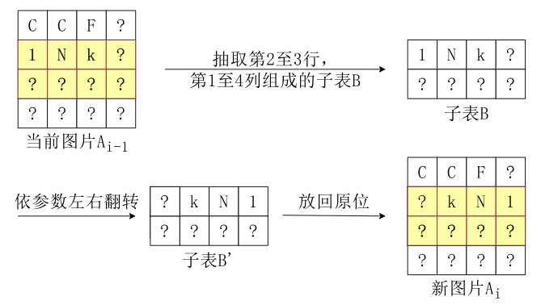
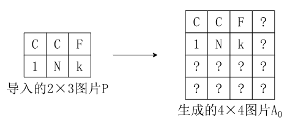

# 图片解码 (decode)

时间限制：1.5 秒
空间限制： 512 MiB
相关文件： [题目目录](题目目录)

## 题目背景

西西艾弗岛上的居民经常使用 InkGraph 系统对自己图片进行加密操作。加密方在加密图片时，将图片输入该系统后可以得到一份系统文件与一个对应的密钥；如果想要获取图片原始信息，接收方需要获取该系统文件与对应的密钥并将它们输入系统，经系统解码后便能获得原始图片。

具体来说，一张图片可以由一个 $n \times m$ 的字符表格 $P$ 来表示，其中位于从上向下数第 $i$ 行，从左向右数第 j 列的字符可以用 $P_{i,j}$ ($1 \le i \le n, 1 \le j \le m$) 来表示。这些字符中仅含有大小写字母、数字和下划线。新加入开发团队的小 C 学习了这个系统的加密方法。

## 加密步骤

加密方在加密一张图片 $P$ 前，需预先设定一个整数规模参数 $Z$ ($1 \le Z \le 400$)。在导入图片 $P$ 后，系统会自动在右下方用字符 `?` 将其补齐成一张 $Z \times Z$ 的正方形图片 $A_0$。
一个对 $2 \times 3$ 图片加密，并设置 $Z=4$ 的例子如下：



系统此时会向用户请求加密次数 $t$，满足 $1 \le t \le 5 \times 10^4$。然后系统会从图片 $A_0$ 开始，进行 $t$ 次加密操作。具体来说，第 $i$ 次加密操作的输入为 $A_{i-1}$，输出为 $A_i$。 $t$ 次加密操作结束后，系统会将加密后的最终结果图 $A_t$ 与代表加密过程的密钥（一个整数序列 $K$）输出到加密获取的系统文件中。在加密过程开始前，系统先向空的密钥 $K$ 中添加一个整数 $t$，即设置 $K_1 = t$。

对于第 $i$ 次加密操作，系统会先自动选择一个加密类型 $op_i \in \{1, 2\}$。

如果 $op_i = 1$，那么第 $i$ 次加密是一次旋转加密。系统会生成一个五维整数向量 $(u_i, v_i, L_i, d_i, r_i)$，满足 $1 \le u_i \le Z, 1 \le v_i \le Z, 1 \le L_i \le \min\{Z, 10\}, u_i + L_i - 1 \le Z, v_i + L_i - 1 \le Z, d_i \in \{90, 180, 270\}, 0 \le r_i \le 3$, 然后抽取出一张图片 $A_{i-1}$ 的从第 $u_i$ 到第 $u_i + L_i - 1$ 行，第 $v_i$ 到第 $v_i + L_i - 1$ 列的大小为 $L_i \times L_i$ 的正方形子表 $B$，将 $B$ 顺时针旋转 $d_i$ 度（角度制）后放在原来的位置上（字符本身不会被旋转）；旋转完成后，再对这张图整体进行 $r_i$ 次逆时针旋转 90 度的操作，从而得到本次加密的结果图 $A_i$。将上例图片作为 $A_{i-1}$ 进行一次 $(2, 2, 3, 90, 1)$ 的旋转加密的过程如下，得到本次加密操作的结果图片 $A_i$：


在本次加密完成后，系统会在密钥序列 $K$ 的后方依次追加 $op_i, u_i, v_i, L_i, d_i, r_i$ 这 6 个数。例如若上述加密过程为第一次加密，密钥序列 $K$ 应形如 $\{t, 1, 2, 2, 3, 90, 1\}$。

如果 $op_i = 2$，那么第 $i$ 次加密是一次翻转加密：系统会生成一个五维整数向量 $(u_i, d_i, l_i, r_i, o_i)$，满足 $1 \le u_i \le d_i \le Z, 1 \le l_i \le r_i \le Z, 1 \le d_i - u_i + 1 \le \min\{Z, 10\}, 1 \le r_i - l_i + 1 \le \min\{Z, 10\}, o_i \in \{-1, 1\}$，然后抽取当前图片 $A_{i-1}$ 的从第 $u_i$ 到第 $d_i$ 行，第 $l_i$ 到第 $r_i$ 列的大小为 $(d_i - u_i + 1) \times (r_i - l_i + 1)$ 的矩形子表 $B$；当 $o_i = 1$ 时，将 $B$ 上下翻转；当 $o_i = -1$ 时，将 $B$ 左右翻转（字符本身不会被翻转），然后放在原来的位置上，从而得到本次加密的结果图 $A_i$。将上例图片作为 $A_{i-1}$ 进行一次 $(2, 3, 1, 4, -1)$ 的翻转加密的过程如下，得到本次加密的结果图片 $A_i$：



在本次加密完成后，系统会在密钥序列 $K$ 的后方依次追加 $op_i, u_i, d_i, l_i, r_i, o_i$ 这 6 个数。例如若上述加密过程为第一次加密，密钥序列 $K$ 应形如 $\{t, 2, 2, 3, 1, 4, -1\}$。

全部 $t$ 次加密过程结束后，最终结果图 $A_t$ 和密钥 $K$ 会被输出至系统文件中。

## 题目描述

小 C 对 InkGraph 系统的解码方法非常感兴趣，想要上手编写这个解码的程序。换句话说，现在他获得了一份系统文件，含有加密的最终结果图 $A_t$ 与对应的密钥序列 $K$，他的程序需要能够还原出加密方导入的原始的图片 $P$。现在，请你帮他完成这个任务。

## 输入格式

从标准输入读入数据。

输入的第一行是一个正整数 $Z$。**保证 $Z$ 不小于加密方输入图片的长和宽，也即加密程序能够正常运作；**
接下来的 $Z$ 行为最终的结果图片 $A_t$。保证每行恰有 $Z$ 个字符，且输入的字符仅包含大小写字母、数字、下划线和问号。
接下来输入一行一个正整数 $k$，表示密钥 $K$ 的长度；然后下一行输入 $k$ 个由空格分隔的整数，表示密钥 $K$。

## 输出格式

输出到标准输出。

第一行输出用空格分隔的两个整数 $n$ 和 $m$，表示还原出的图片 $P$ 的宽度和长度。
接下来输出 $n$ 行，每行 $m$ 个字符，仅含有大小写字母、数字和下划线，表示原本的图片。

## 样例1输入

```
4
?Nk?
??F?
??C?
C1??
13
2 1 2 2 3 90 1 2 2 3 1 3 -1
```

## 样例1输出

```
2 3
CCF
1Nk
```

## 子任务

| 测试点编号 | 约束 |
| :--- | :--- |
| $1 \sim 5$ | 保证 $op_i = 2$ 且 $Z \le 10$ |
| $6 \sim 10$ | 保证 $op_i = 2$ |
| $11 \sim 15$ | 保证 $Z \le 10$ |
| $16 \sim 20$ | 保证 $Z \le 400$ |
