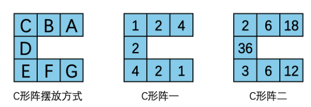
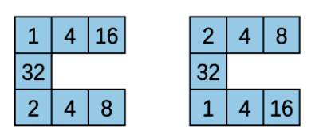

# C形阵 (square)

## 题目背景

小 C 在西西艾弗大学担任研究员。今天他遇到了一个优美的数阵，并让作为助手的你来帮他做一些计算。

## 题目描述

小 C 将这个数阵称为 **C 形阵**。数阵的数 $(A, B, C, D, E, F, G)$ 满足如下几条性质：
1. $A, B, C, D, E, F, G$ 都是正整数
2. $\frac{A}{B} = \frac{B}{C}$
3. $\frac{E}{F} = \frac{F}{G}$
4. $A \times B \times C = C \times D \times E = E \times F \times G$

并按下图所示放置于 C 形阵中：



小 C 定义这个 C 形阵的大小为 $B$，价值为 $D$。

若这个 C 形阵满足集合 $\{A, B, C, D, E, F, G\}$ 中恰有 6 个互不相同的元素，即 $|\{A, B, C, D, E, F, G\}| = 6$，则称这个 C 形阵为 **完美的 C 形阵**。以上图两个 C 形阵为例，C 形阵一不是一个 **完美的 C 形阵**，C 形阵二是一个 **完美的 C 形阵**。小 C 并不是个追求完美的人，因此他会通过掷硬币决定是否研究完美的 C 形阵。

具体地，小 C 会给你两个整数 $op, n$，若 $op = 0$，你需要求出所有大小不超过 $n$ 的 C 形阵价值总和；若 $op = 1$，你需要求出所有大小不超过 $n$ 的 **完美的 C 形阵** 价值总和。答案需要对 998244353 取模。

## 输入格式

从标准输入读入数据。

输入仅有一行，包含两个整数 $op, n$，其含义同题目描述。

## 输出格式

输出到标准输出。

输出一个正整数，表示题目要求的价值总和。

## 样例1输入

```
0 2
```

## 样例1输出

```
25
```

## 样例1解释

| 方案 | $A$ | $B$ | $C$ | $D$ | $E$ | $F$ | $G$ |
| :--: | :-: | :-: | :-: | :-: | :-: | :-: | :-: |
| 1 | 1 | 1 | 1 | 1 | 1 | 1 | 1 |
| 2 | 1 | 2 | 4 | 1 | 2 | 2 | 2 |
| 3 | 1 | 2 | 4 | 2 | 1 | 2 | 4 |
| 4 | 2 | 2 | 2 | 1 | 4 | 2 | 1 |
| 5 | 2 | 2 | 2 | 2 | 2 | 2 | 2 |
| 6 | 2 | 2 | 2 | 4 | 1 | 2 | 4 |
| 7 | 4 | 2 | 1 | 2 | 4 | 2 | 1 |
| 8 | 4 | 2 | 1 | 4 | 2 | 2 | 2 |
| 9 | 4 | 2 | 1 | 8 | 1 | 2 | 4 |

表格列举了所有符合条件的 C 形阵，总价值为 25。

## 样例2输入

```
1 4
```

## 样例2输出

```
64
```

## 样例2解释

下面列举了所有符合条件的 C 形阵，总价值为 $32 + 32 = 64$。



## 子任务

本题采用捆绑测试，你只有通过一个子任务中的所有测试点才能得到该子任务的分数。

- 子任务一（30分）：$n \le 10$；
- 子任务二（20分）：$op = 0, n \le 10^5$；
- 子任务三（30分）：$n \le 10^5$；
- 子任务四（10分）：$op = 0$；
- 子任务五（10分）：无特殊限制。

全部测试数据满足：$op \in \{0, 1\}$ 且 $1 \le n \le 10^7$。
